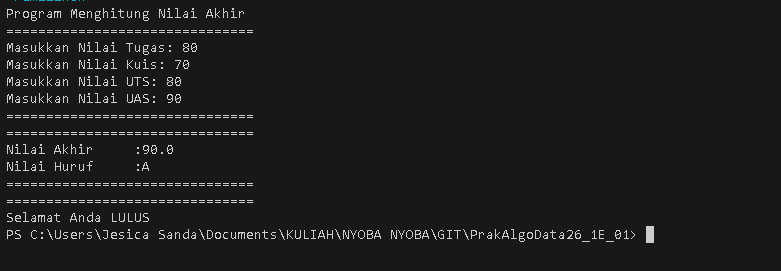
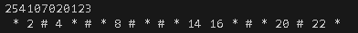
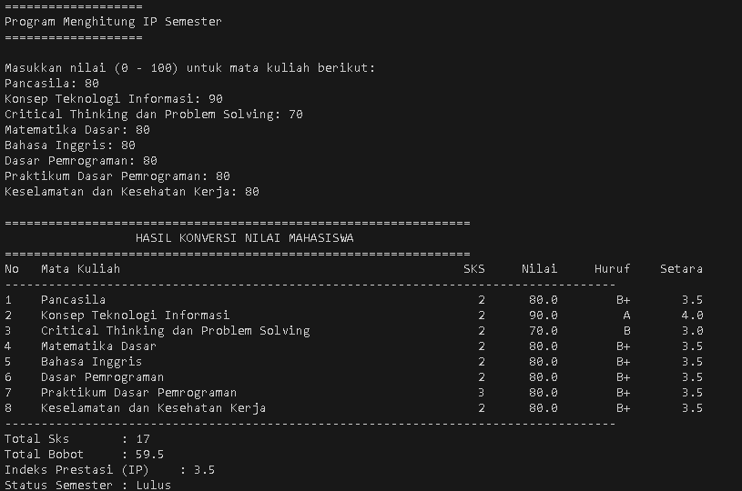
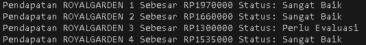
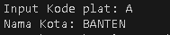
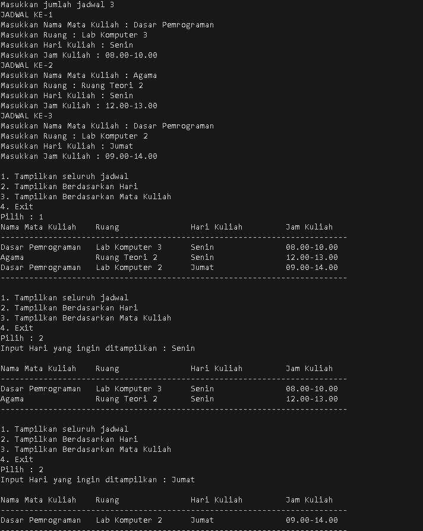
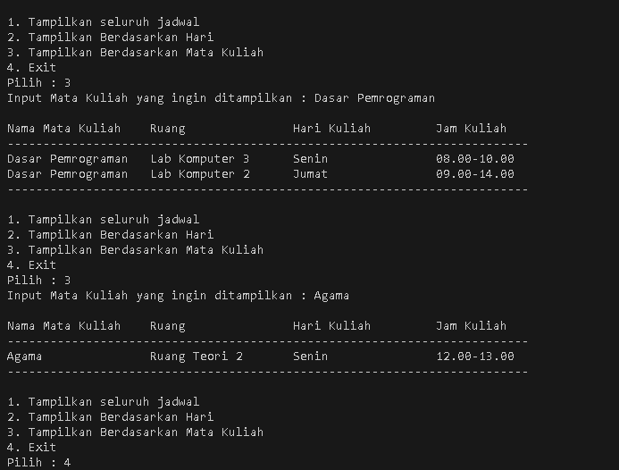

# REPORT

Answer on jobsheet 1.

## Description

My answer on jobsheet 1.
From Pemilihan to Tugas 2.

## Dependencies

* JDK version 8 minimum (Mine JDK 24.0.2),
* Operating System (Mine Windows),
* Text editor e.g. VSCode (Mine VSCode).

## Executing program

### 1. Pemilihan

* How to run the program.
Enter this in the terminal.
```bash
java '.\Pertemuan 1\src\Pemilihan.java'
```
Or
```bash
cd '.\Pertemuan 1\src\'
java Pemilihan.java
```
* Output



### 2. Perulangan

* How to run the program.
Enter this in the terminal.
```bash
java '.\Pertemuan 1\src\Perulangan.java'
```
Or
```bash
cd '.\Pertemuan 1\src\'
java Perulangan.java
```
* Output



### 3. Array

* How to run the program.
Enter this in the terminal.
```bash
java '.\Pertemuan 1\src\Array.java'
```
Or
```bash
cd '.\Pertemuan 1\src\'
java Array.java
```
* Output



### 4. Fungsi

* How to run the program.
Enter this in the terminal.
```bash
java '.\Pertemuan 1\src\Fungsi.java'
```
Or
```bash
cd '.\Pertemuan 1\src\'
java Fungsi.java
```
* Output



### 5. Tugas 1

* How to run the program.
Enter this in the terminal.
```bash
java '.\Pertemuan 1\src\Tugas1.java'
```
Or
```bash
cd '.\Pertemuan 1\src\'
java Tugas1.java
```
* Output



### 6. Tugas 2

* How to run the program.
Enter this in the terminal.
```bash
java '.\Pertemuan 1\src\Tugas2.java'
```
Or
```bash
cd '.\Pertemuan 1\src\'
java Tugas2.java
```
* Output





## Authors
Adrian Alexander Sanda.
