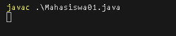
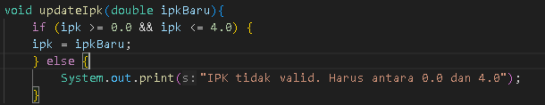
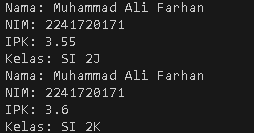
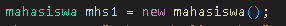
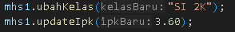
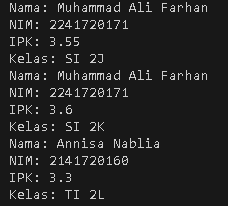

# REPORT

Answer on jobsheet 2.

## Description

My answer on jobsheet 2.
From Deklarasi Class to Tugas 2.

## Dependencies

* JDK version 8 minimum (Mine JDK 24.0.2),
* Operating System (Mine Windows),
* Text editor e.g. VSCode (Mine VSCode).

## Executing program

### 1. Deklarasi Class, Atribut dan Method

* How to run the program.
Tidak bisa di compile dikarenakan tidak ada method Main
* Output\



* Question
1. Sebutkan dua karakteristik class atau object!\
Answer: Mempunyai Atribut dan Method,\
&emsp;&emsp;&emsp; Class adalah blueprint atau cetakan untuk membuat suatu Object.

2. Perhatikan class Mahasiswa pada Praktikum 1 tersebut, ada berapa atribut yang dimiliki oleh class
Mahasiswa? Sebutkan apa saja atributnya!\
Answer: Ada 4 atribut yaitu: \
&emsp;&emsp;&emsp;1. Nama\
&emsp;&emsp;&emsp;2. Nim\
&emsp;&emsp;&emsp;3. Kelas\
&emsp;&emsp;&emsp;4. IPK 

3. Ada berapa method yang dimiliki oleh class tersebut? Sebutkan apa saja methodnya!\
Answer: Ada 4 Method yaitu: \
&emsp;&emsp;&emsp;1. tampilkanInformasi()\
&emsp;&emsp;&emsp;2. ubahKelas(String kelasBaru)\
&emsp;&emsp;&emsp;3. updateIpk(double ipkBaru)\
&emsp;&emsp;&emsp;4. nilaiKinerja()

4. Perhatikan method updateIpk() yang terdapat di dalam class Mahasiswa. Modifikasi isi method tersebut sehingga IPK yang dimasukkan valid yaitu terlebih dahulu dilakukan pengecekan apakah IPK yang dimasukkan di dalam rentang 0.0 sampai dengan 4.0 (0.0 <= IPK <= 4.0). Jika IPK tidak pada rentang tersebut maka dikeluarkan pesan: "IPK tidak valid. Harus antara 0.0 dan 4.0".\
Answer:\


5. Jelaskan bagaimana cara kerja method nilaiKinerja() dalam mengevaluasi kinerja mahasiswa, kriteria apa saja yang digunakan untuk menentukan nilai kinerja tersebut, dan apa yang dikembalikan (di-return-kan) oleh method nilaiKinerja() tersebut?\
Answer: nilaiKinerja mengecek nilai dari ipk, jika nilai dari ipk lebih atau sama dengan 3.5 maka Return "Kinerja sangat baik", sedangnkan jika ipk lebih atau sama dengan 3.0 maka return "Kinerja baik", dan jika nilai dari ipk lebih atau sama dengan 2.0 maka Return "Kinerja cukup", selain itu maka Return "Kinerja kurang"

### 2. Instansiasi Object, serta Mengakses Atribut dan Method

* How to run the program.
Enter this in the terminal.
```bash
java '.\Pertemuan 2\src\MahasiswaMain01.java'
```
Or
```bash
cd '.\Pertemuan 2\src\'
java MahasiswaMain01.java
```
* Output



* Question
1. Pada class MahasiswaMain, tunjukkan baris kode program yang digunakan untuk proses
instansiasi! Apa nama object yang dihasilkan?\
Answer: Kode program yang dipakai unutk instansisasi adalah

2. Bagaimana cara mengakses atribut dan method dari suatu objek?\
Answer: dengan menggunakan namaObject.atribut untuk mengakses atribut sedangkan namaObject.method untuk mengcalling method, contoh:\

3. Mengapa hasil output pemanggilan method tampilkanInformasi() pertama dan kedua berbeda?\
Answer: nilai dari Atribut mhs1 sudah di manipulasi oleh method mhs1 yaitu method ubahKelas(String kelasBaru) dan method updateIpk(double ipkBaru),


### 3. Membuat Konstruktor

* How to run the program.
Enter this in the terminal.
```bash
java '.\Pertemuan 2\src\MahasiswaMain01.java'
```
Or
```bash
cd '.\Pertemuan 2\src\'
java MahasiswaMain01.java
```
* Output



* Question
1. Pada class Mahasiswa di Percobaan 3, tunjukkan baris kode program yang digunakan untuk
mendeklarasikan konstruktor berparameter!\
Answer: 
```bash
public Mahasiswa01(String nm, String nim,double ipk,String kls){
        nama = nm;
        this.nim = nim;
        this.ipk = ipk;
        kelas = kls; 
    }
```

2. Perhatikan class MahasiswaMain. Apa sebenarnya yang dilakukan pada baris program
berikut? \
Answer: Instansiasi object menggunakan konstruktor, code itu membuat object mhs2 dan object tersebut diberikan parameter ("Annisa Nablia","2141720160", 3.25, "TI 2L"), parameter tersebut digunakan oleh konstruktor untuk memasuki atribut kedalam object mhs 2.
3. Hapus konstruktor default pada class Mahasiswa, kemudian compile dan run program.
Bagaimana hasilnya? Jelaskan mengapa hasilnya demikian!\
Answer: terjadi error pada kode object mhs1, diakarenakan mhs1 menggunakan konstruktor default pada class mahasiswa
```bash
Mahasiswa01 mhs1 = new Mahasiswa01();
```
4.  Setelah melakukan instansiasi object, apakah method di dalam class Mahasiswa harus diakses
secara berurutan? Jelaskan alasannya!\
Answer: Tidak, sebuah method dalam class bisa dipanggil kapan saja dan berulang kali.
5. Buat object baru dengan nama mhs<NamaMahasiswa> menggunakan konstruktor
berparameter dari class Mahasiswa!\
Answer:
```bash
Mahasiswa01 mhsAdrian = new Mahasiswa01("Adrian Alexander Sanda", "254107020138", 3.95, "TI 1E");
mhsAdrian.tampilkaninformasi();
```
Output
``` shell
Nama: Muhammad Ali Farhan
NIM: 2241720171
IPK: 3.55
Kelas: SI 2J
Nama: Muhammad Ali Farhan
NIM: 2241720171
IPK: 3.6
Kelas: SI 2K
Nama: Annisa Nablia
NIM: 2141720160
IPK: 3.3
Kelas: TI 2L
Nama: Adrian Alexander Sanda
NIM: 254107020138
IPK: 3.95
Kelas: TI 1E
```
### 4. Latihan Praktikum MataKuliah

* How to run the program.
Enter this in the terminal.
```bash
java '.\Pertemuan 2\src\MataKuliahMain01.java'
```
Or
```bash
cd '.\Pertemuan 2\src\'
java MataKuliahMain.java
```
* Output
```bash
Kode Mata Kuliah: ASD
Nama Mata Kuliah: Algoritma dan Struktur Data
Jumlah SKS Mata Kuliah: 6
Jumlah Jam Mata Kuliah: 12
SKS sudah diubah!
Pengurangan tidak dapat dilakukan!
Jumlah Jam terbaru: 6
Kode Mata Kuliah: ASD
Nama Mata Kuliah: Algoritma dan Struktur Data
Jumlah SKS Mata Kuliah: 5
Jumlah Jam Mata Kuliah: 6
Kode Mata Kuliah: AGM
Nama Mata Kuliah: Agama
Jumlah SKS Mata Kuliah: 4
Jumlah Jam Mata Kuliah: 8
SKS sudah diubah!
Pengurangan tidak dapat dilakukan!
Jumlah Jam terbaru: 10
Kode Mata Kuliah: AGM
Nama Mata Kuliah: Agama
Jumlah SKS Mata Kuliah: 5
Jumlah Jam Mata Kuliah: 10
```

### 5. Latihan Praktikum Dosen

* How to run the program.
Enter this in the terminal.
```bash
java '.\Pertemuan 2\src\DosenMain01.java'
```
Or
```bash
cd '.\Pertemuan 2\src\'
java DosenMain.java
```
* Output
```bash
ID Dosen: NBR
Nama Dosen: Nobberu
Status Aktif Dosen: Tidak Aktif
Tahun Bergabung Dosen: 1999
Bidang Keahlian Dosen: Desain Antarmuka
Masa Kerja: 27
ID Dosen: NBR
Nama Dosen: Nobberu
Status Aktif Dosen: Aktif
Tahun Bergabung Dosen: 1999
Bidang Keahlian Dosen: UI/UX
ID Dosen: AAS
Nama Dosen: Adrian Alexander Sanda
Status Aktif Dosen: Aktif
Tahun Bergabung Dosen: 2008
Bidang Keahlian Dosen: Cyber Security
Masa Kerja: 18
ID Dosen: AAS
Nama Dosen: Adrian Alexander Sanda
Status Aktif Dosen: Tidak Aktif
Tahun Bergabung Dosen: 2008
Bidang Keahlian Dosen: Nasi Goreng
```


## Authors
Adrian Alexander Sanda.
